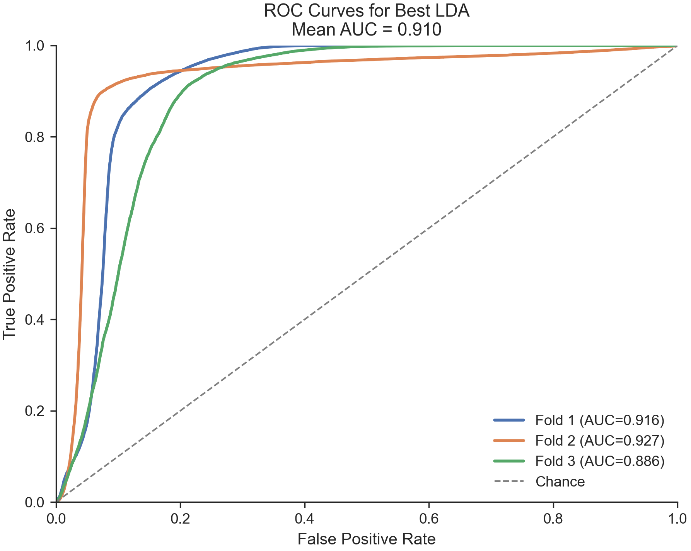
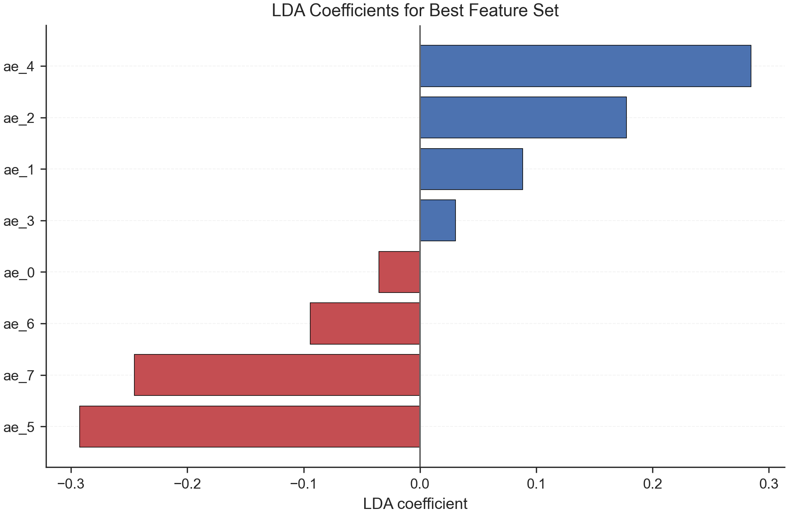

## Overview

This document summarizes the Linear Discriminant Analysis (LDA) experiments for Part 3. We compared one shrinkage-LDA classifier across three feature sets:

- `handcrafted`: the eight original engineered variables `NDAI`, `SD`, `CORR`, `DF`, `CF`, `BF`, `AF`, and `AN`
- `ae_only`: the eight latent variables extracted from the autoencoder, `ae_0` through `ae_7`
- `combined`: the concatenation of the handcrafted and autoencoder feature sets

The goal was to evaluate whether the autoencoder embeddings improve linear class separation for pixel-level cloud detection.

## Modeling Setup

We used a shrinkage version of LDA:

- model: `LinearDiscriminantAnalysis(solver="lsqr", shrinkage="auto")`
- response: binary cloud indicator
- evaluation: image-level grouped 3-fold cross-validation

The grouped cross-validation design is important because pixels from the same image are spatially dependent. Instead of randomly splitting pixels, each fold holds out one entire labeled image.

## Data and Cross-Validation Design

The labeled data consist of three images:

- `O012791.npz`
- `O013257.npz`
- `O013490.npz`

The evaluation uses `GroupKFold(n_splits = 3)` with image identity as the grouping variable, so each fold uses two images for training and one image for testing. This is closer to the real deployment setting, where the model must generalize to a new image rather than to nearby pixels from an image it has already seen.

## Load Saved Results

```{python}
import pandas as pd
from pathlib import Path

results_dir = Path("../code/LDA_model/results/part3_lda")
summary_df = pd.read_csv(results_dir / "lda_model_summary.csv")
fold_df = pd.read_csv(results_dir / "lda_fold_metrics.csv")
coef_df = pd.read_csv(results_dir / "best_lda_coefficients.csv")

summary_df
```

## Overall Comparison

The table below compares the three feature sets using mean metrics across the three grouped folds.

```{python}
summary_df.round(4)
```

### Main Findings


## Fold-Level Performance

To understand stability, it is helpful to inspect performance on each held-out image.

```{python}
fold_df.round(4)
```

### Interpretation

- `handcrafted` performs very well on one held-out image (`AUC = 0.9643`) but drops substantially on the other two (`0.7449` and `0.7635`).
- `ae_only` is much more stable across folds, with ROC-AUC values of `0.9161`, `0.9275`, and `0.8865`.
- `combined` performs reasonably well, but still shows a larger fold-to-fold drop than `ae_only`.

This stability pattern is one reason `ae_only` is preferred as the best LDA feature set.

## ROC Curve for the Best LDA Model

The following ROC plot shows the three held-out folds for the best LDA model.



The plot confirms that the best LDA model maintains strong discrimination across all three folds, with a mean ROC-AUC close to `0.91`.

## Coefficient Analysis

Because the best LDA model was trained on `ae_only`, the coefficient plot shows how the eight latent dimensions contribute to the linear decision rule.



The coefficient table is:

```{python}
coef_df.round(4)
```

### Interpretation of Coefficients

- The largest positive coefficients are associated with `ae_4` and `ae_2`.
- The largest negative coefficients are associated with `ae_5` and `ae_7`.
- Since these are latent autoencoder dimensions, they do not have a direct physical interpretation like `NDAI` or `CORR`.
- However, the size of the coefficients indicates that a relatively small subset of latent directions drives most of the linear discrimination between cloud and non-cloud pixels.

## Why Might `ae_only` Beat `combined` for LDA?

There are several plausible explanations:

1. The autoencoder may have already summarized the most useful local patch structure into a compact representation.
2. Adding handcrafted variables can introduce extra correlation and noise into the covariance estimate.
3. LDA is a linear classifier with a shared covariance assumption, so a more compact latent representation may fit its assumptions better than a mixed, higher-dimensional feature space.

This does not imply that `combined` is always worse. It only suggests that, for this particular classifier and grouped evaluation design, the pure autoencoder embedding gave the most effective linear class separation.

## Limitations

- We only have three labeled images, so fold-to-fold variability remains important.
- The evaluation uses grouped cross-validation rather than a separate validation and final test set, because the labeled sample size is extremely limited.
- LDA assumes approximately class-conditional Gaussian structure with a shared covariance matrix, which is unlikely to hold exactly for these features.
- The latent autoencoder features improve predictive performance, but they are less directly interpretable than the handcrafted physical variables.

## Conclusion

Among the three feature sets tested with shrinkage-LDA, the `ae_only` representation gave the strongest and most stable performance:

- best mean ROC-AUC: `0.9100`
- mean F1: `0.6678`
- mean accuracy: `0.7878`

For this analysis, the main takeaway is that the autoencoder features appear to be more useful for linear discrimination than the handcrafted variables alone. They likely encode local patch-level spatial structure that is difficult to recover from the original handcrafted features by themselves.
